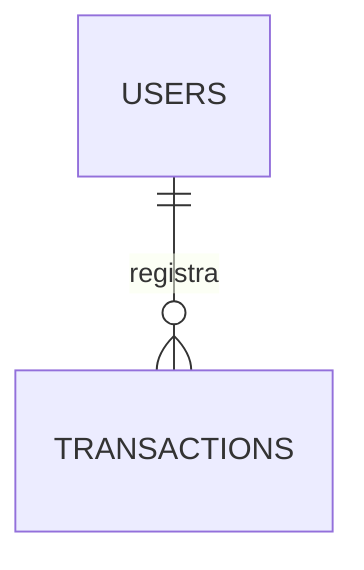

# Modelagem de Dados - Micro MVP

Este documento apresenta a modelagem simplificada do banco de dados relacional para o Micro MVP. Ele foi desenhado para ser o mais enxuto possível, utilizando apenas duas tabelas básicas.

---

## Diagrama Entidade-Relacionamento (ERD)

---

## Definição das Tabelas

### 1. Usuários (`users`)
* **Objetivo**: Guardar as credenciais básicas do usuário.
* **Campos**:
  | Campo | Tipo | Restrições | Descrição |
  | :--- | :--- | :--- | :--- |
  | `id` | UUID | PK | Identificador único universal. |
  | `name` | VARCHAR(100) | NOT NULL | Nome do usuário. |
  | `email` | VARCHAR(255) | UNIQUE, NOT NULL | E-mail para acesso. |
  | `password_hash` | VARCHAR(255) | NOT NULL | Senha criptografada. |
  | `created_at` | TIMESTAMP | DEFAULT NOW() | Registro de criação da conta. |

### 2. Transações (`transactions`)
* **Objetivo**: Armazenar o fluxo de caixa (entradas e saídas) do usuário.
* **Campos**:
  | Campo | Tipo | Restrições | Descrição |
  | :--- | :--- | :--- | :--- |
  | `id` | UUID | PK | Identificador único da transação. |
  | `user_id` | UUID | FK -> `users.id` | Proprietário da transação. |
  | `description` | VARCHAR(100) | Nullable | Descrição rápida opcional do gasto/receita. |
  | `amount` | DECIMAL(15,2) | NOT NULL | Valor monetário da operação (sempre maior que zero). |
  | `type` | ENUM | NOT NULL | Tipo de transação: `INCOME` (Receita) ou `EXPENSE` (Despesa). |
  | `category` | ENUM | NOT NULL | Categoria da transação: `SALARIO`, `EXTRA`, `ALIMENTACAO`, `MERCADO`, `TRANSPORTE`, `OUTROS`. |
  | `date` | DATE | NOT NULL | Data da movimentação. |
  | `created_at` | TIMESTAMP | DEFAULT NOW() | Data de registro no sistema. |

---

## Próximos Passos
1. Criar o script SQL de DDL para criação destas duas tabelas.
2. Criar a API CRUD básica de transações.
