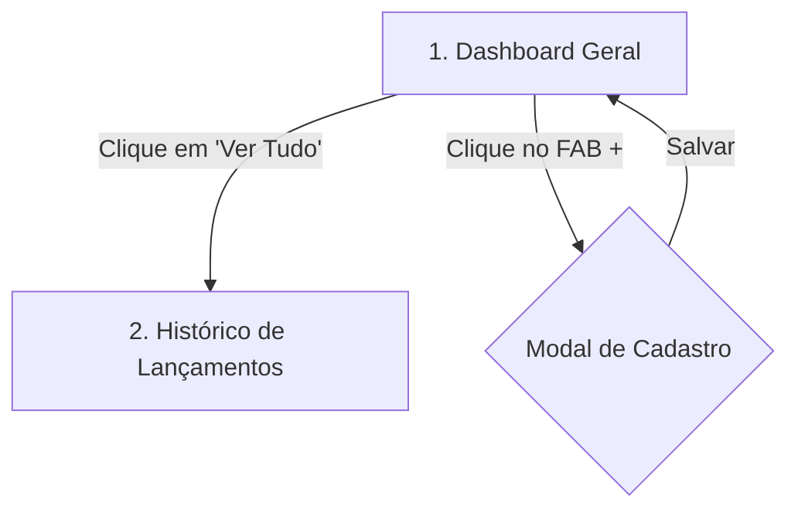

# Arquitetura Funcional - Micro MVP

Este documento define as telas e os fluxos de navegação simplificados para o Micro MVP de finanças pessoais.

---

## 1. Mapa de Telas

O aplicativo possui apenas **2 telas principais**:

---

## 2. Detalhamento das Telas

### Tela 1: Dashboard Geral (Cockpit)
* **Objetivo**: Fornecer a resposta imediata de "quanto sobrou" e para onde foi o dinheiro.
* **Componentes**:
  * **Painel de Saldos**:
    * **Sobrou (Saldo Disponível)**: Valor líquido restante.
    * **Entradas**: Soma de receitas.
    * **Saídas**: Soma de despesas.
  * **Distribuição de Gastos**: Lista das 4 categorias de despesas (`Alimentação`, `Mercado`, `Transporte`, `Outros`) em formato de barras de progresso horizontais, indicando o valor total gasto e o percentual sobre a despesa total.
  * **Últimos Lançamentos**: Lista simplificada com as 5 transações mais recentes.
  * **Link 'Ver Tudo'**: Redireciona para a tela de *Histórico*.
  * **Botão FAB (+)**: Botão de ação rápida para novos registros.

### Tela 2: Histórico de Lançamentos
* **Objetivo**: Permitir auditoria e exclusão de qualquer registro do mês.
* **Componentes**:
  * Lista de todas as transações cadastradas no mês corrente.
  * Botão de exclusão (lixeira) ao lado de cada transação.

---

## 3. Fluxo de Lançamento Rápido (FAB)

1. Usuário toca no **FAB (+)**.
2. Abre-se a Bottom Sheet com o foco automático no campo de entrada do **Valor**.
3. O usuário digita o valor.
4. O usuário escolhe a Categoria (`Alimentação`, `Mercado`, `Transporte`, `Outros`) que serve também como gatilho de tipo de despesa. Para receitas, há uma chave rápida "Entrada".
5. O usuário clica em **Salvar**. A Bottom Sheet fecha e a tela principal é recarregada exibindo os saldos e as barras atualizados.
