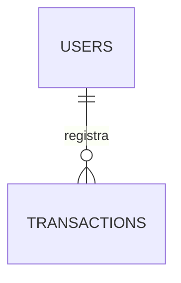

# Product Requirements Document (PRD) - Micro MVP

**Projeto**: Aplicativo de Organização Financeira Pessoal (Micro MVP)  
**Versão**: 2.0 (Foco Exclusivo em Fluxo de Caixa Simples)  
**Status**: Pronto para Desenvolvimento  
**Autor**: Product Management & UX/UI Design  

---

## 1. Objetivo e Filosofia do Micro MVP

### Objetivo
Construir a versão mais simples e rápida possível do aplicativo para permitir que o usuário:
1. Registre suas entradas (receitas).
2. Registre seus gastos focando apenas em: **Alimentação**, **Mercado** e **Transporte** (com uma categoria genérica "Outros").
3. Saiba instantaneamente **quanto sobra no final do mês** e **quanto pode ser destinado para investimentos**.

### Filosofia
* **Escopo Minimalista**: Excluir qualquer funcionalidade que exija configuração ou controle de saldo de contas bancárias.
* **Atrito Próximo de Zero**: Apenas um fluxo simples de entrada de dados, sem necessidade de títulos, notas ou vinculação a bancos.
* **Cálculo Dinâmico**: O saldo não é persistido, sendo calculado em tempo real a partir das transações.

---

## 2. Mapa de Telas e Funcionalidades (Escopo Simplificado)

O aplicativo foi reduzido a apenas **uma tela principal de fluxo contínuo** (Single Page App) com uma tela secundária de histórico simples.

### Tela 1: Visão Geral (Dashboard Único)
* **Indicadores do Topo**:
  * **Disponível para Investir (Sobrou)**: Total de entradas menos despesas do mês corrente.
  * **Total Entradas**: Soma de todas as receitas do mês.
  * **Total Saídas**: Soma de todas as despesas do mês.
* **Gráfico de Barras por Categoria**:
  * Alimentação (R$ gasto e % do total)
  * Mercado (R$ gasto e % do total)
  * Transporte (R$ gasto e % do total)
  * Outros (R$ gasto e % do total)
* **Últimos Lançamentos**: Lista com as últimas 5 transações registradas.
* **Botão Flutuante (FAB +)**: Abre a gaveta de lançamento rápido.

### Tela 2: Histórico de Lançamentos (Lista Completa)
* Acessada clicando em "Ver Tudo" nos Últimos Lançamentos do Dashboard.
* Exibe a lista completa de movimentações do mês.
* Permite **excluir** qualquer transação com um deslize (swipe) ou clique em excluir.

---

## 3. Estrutura de Dados Simplificada (Sem Contas ou Cartões)

O banco de dados foi reduzido para apenas **2 tabelas**, eliminando as entidades de contas, cartões, orçamentos, benefícios e investimentos.

### Tabelas do Banco de Dados

#### 1. Usuários (`users`)
* **Objetivo**: Controlar o acesso do usuário à sua própria base de dados.
* **Campos**:
  * `id`: UUID (PK)
  * `name`: VARCHAR(100) (NOT NULL)
  * `email`: VARCHAR(255) (UNIQUE, NOT NULL)
  * `password_hash`: VARCHAR(255) (NOT NULL)
  * `created_at`: TIMESTAMP (DEFAULT NOW())

#### 2. Transações (`transactions`)
* **Objetivo**: Armazenar todas as entradas e saídas financeiras do usuário.
* **Campos**:
  * `id`: UUID (PK)
  * `user_id`: UUID (FK -> `users.id`)
  * `description`: VARCHAR(100) (Nullable - opcional para o usuário)
  * `amount`: DECIMAL(15,2) (NOT NULL)
  * `type`: ENUM('INCOME', 'EXPENSE') (NOT NULL)
  * `category`: ENUM('SALARIO', 'EXTRA', 'ALIMENTACAO', 'MERCADO', 'TRANSPORTE', 'OUTROS') (NOT NULL)
  * `date`: DATE (NOT NULL - default Hoje)
  * `created_at`: TIMESTAMP (DEFAULT NOW())

---

## 4. Regras de Negócio e Cálculos

### Lógica de Cálculo de Saldos
* O saldo disponível/investível é calculado dinamicamente em tempo real:
  $$\text{Sobrou} = \sum \text{transactions.amount} \ (\text{type} = \text{'INCOME'}) - \sum \text{transactions.amount} \ (\text{type} = \text{'EXPENSE'})$$
  *(Filtrado apenas para transações do mês corrente)*.

### Exclusão de Lançamentos
* Como não há tabela de contas físicas, excluir uma transação apenas requer a remoção física do banco de dados. Os saldos e gráficos do Dashboard serão recalculados automaticamente na próxima atualização de tela.

### Transição de Meses
* O sistema é puramente baseado em filtros temporais de data (`transactions.date`). O fechamento do mês anterior e abertura do novo ocorrem de forma transparente à medida que a data do celular avança.

---

## 5. Experiência de Uso Diária (Fluxo de Lançamento)

1. O usuário abre o app.
2. Clica no **FAB (+)** no centro inferior.
3. Abre-se a Bottom Sheet:
   * **Seletor de Tipo**: `Despesa` (selecionado por padrão) ou `Receita`.
   * **Foco Automático**: O teclado numérico abre focado no campo **Valor**.
   * **Seletor de Categoria (Ícones Rápidos)**: `Alimentação`, `Mercado`, `Transporte` ou `Outros`.
4. Usuário digita o valor, clica no ícone da categoria e clica em **Salvar**.
5. O modal fecha com uma micro-animação e o indicador "Disponível para Investir" é atualizado na hora.
